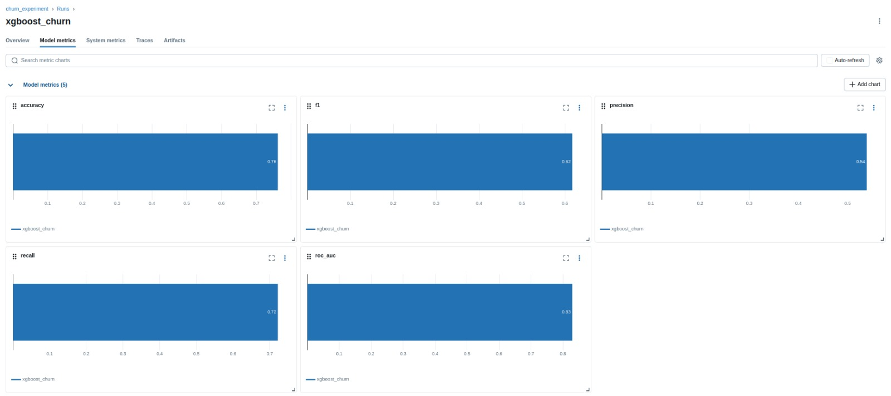

<p align="center">
  <!-- Status do CI/CD via GitHub Actions -->
  

  <!-- Versão de Python -->
  

  <!-- Docker -->
  

  <!-- MLflow -->
  

  <!-- scikit-learn -->
  

  <!-- FastAPI -->
  

  <!-- Streamlit -->
  

  <!-- Licença -->
  
</p>

<div align="center">

# 📉 Churn Prediction Project 


CI/CD • MLFlow • FastAPI • Streamlit • Dockerized 

</div>

---
## Visão Geral

Este projeto tem como objetivo **prever o cancelamento de clientes (churn)** utilizando técnicas de **Ciência de Dados e Machine Learning**.  
Ao identificar clientes com maior risco de saída, empresas podem **reduzir perdas financeiras**, **aumentar a retenção** e **direcionar estratégias de marketing e relacionamento** de forma mais eficaz.

---


### Contexto de Negócio:

O churn é um dos principais desafios para empresas em setores competitivos, como telecom, fintechs, SaaS e varejo.

- Impacto direto: cada cliente perdido significa redução de receita e aumento de custos de aquisição de novos clientes (CAC).

- Oportunidade: prever churn permite aplicar ações como:

    - Descontos direcionados

    - Treinamento de equipe de suporte

    - Campanhas personalizadas de engajamento

    - Contato proativo com clientes em risco

### Objetivos do Projeto:

- Identificar clientes propensos ao churn com base em seu histórico e comportamento.

- Priorizar clientes estratégicos para retenção, aumentando o LTV (Lifetime Value).

- Mensurar impacto financeiro das ações de retenção.

- Oferecer insights acionáveis para as áreas de marketing, produto e atendimento.

### Etapas do Projeto:

- Análise Exploratória (EDA)

    - Compreensão do perfil dos clientes

    - Identificação de padrões relacionados ao cancelamento

    - Métricas descritivas de retenção

- Modelagem Preditiva

    - Algoritmos de classificação (Regressão Logística, XGBoost)

    - Comparação de performance entre modelos

- Avaliação de Impacto

    - Métricas técnicas: ROC-AUC, F1-Score, Precisão e Recall

    - Métricas de negócio: Receita retida, impacto no churn, ROI das ações

### Resultados Esperados:

- Segmentação de clientes em risco: possibilitando campanhas mais assertivas.

- Redução de custos de aquisição: reter clientes existentes é mais barato que adquirir novos.

- Aumento de receita: maior retenção implica em maior LTV.

- Decisões orientadas por dados: suporte a estratégias de CRM, marketing e produto.

###  Tecnologias Utilizadas:

- **Python 3.11**
- **Pandas, NumPy** → manipulação e análise de dados
- **Matplotlib, Seaborn** → visualização e insights exploratórios
- **Scikit-learn** → modelagem e métricas
- **XGBoost** → algoritmo avançado de boosting
- **MLflow** → rastreamento de experimentos
- **FastAPI** → API de predição  
- **Docker / Docker Compose** → deploy em produção  
- **Streamlit** → dashboard interativo  

---
## 📜 Estrutura do Projeto

```
Churn_Prediction/
│── app/                 # API FastAPI
│   ├── main.py
│   └── churn_prediction.pkl
│
│── mlruns/              # Experimentos do MLflow
│── notebook/            # Notebooks de exploração
│── reports/             # PDFs, imagens, métricas
│── src/                 # Código fonte (predict, treino, testes)
│── streamlit/           # Dashboard interativo
│── docker-compose.yml   # Orquestração Docker
│── Dockerfile.api       # Build da API
│── requirements.txt     # Dependências
│── README.md            # Este documento
```


## 🤖 MLflow  
Usado para rastrear experimentos, métricas e versões de modelos.  

Principais métricas:  
- ROC-AUC  
- F1-Score  
- Recall e Precisão  
- Receita retida estimada  

 <!-- substitua por seu print real -->

---

## ⚙️ API de Predição (FastAPI + Docker)  
A API disponibiliza o modelo de predição em produção.
API construída em **FastAPI**, framework moderno e rápido para aplicações em Python.

Dois endpoints principais:

  - GET / → Health check (confirma se a API está rodando).

  - POST /predict → Recebe dados de clientes e retorna a predição de churn com probabilidade associada.  

O projeto já suporta execução com Uvicorn e pode ser containerizado via Docker.


### 🔧 Construir a imagem  
```
docker build -f Dockerfile.api -t churn-api .
```

### 🚀 Rodar a API
```
docker run -p 8000:8000 churn-api
```

Acesse a documentação interativa:
👉 http://localhost:8000/docs


#### 🎬 API em funcionamento

[▶️ Assista à demonstração](./reports/API.mp4)


---
### 📚 Como testar a API

#### 🔹 Via curl
```
curl -X POST http://localhost:8000/predict \
  -H "Content-Type: application/json" \
  -d @test_payload.json
```

#### 🔹 Via Python requests
```
import requests

url = "http://localhost:8000/predict"
Request body:
{
  "data": [
    {
      "contrato": "Mensal",
      "emite_boletos": "Sim",
      "faz_conciliacao_bancaria": "Automática",
      "fundacao_da_empresa": 2015,
      "meses_permanencia": 12,
      "possui_contador": "Sim",
      "receita_mensal": 1500,
      "receita_total": 18000,
      "tipo_de_empresa": "SaaS",
      "utiliza_servicos_financeiros": "Não"
    }
  ]
}

response = requests.post(url, json=payload)
print(response.json())
```

Resposta esperada:
```
{
  "predictions": [
    "Não"
  ],
  "probabilities": [
    0.08
  ]
}
```

---
## 📊 Dashboard de Monitoramento (Streamlit)

Este projeto conta com um dashboard interativo desenvolvido com **Streamlit**, que permite analisar, visualizar e monitorar o desempenho de um modelo de predição de churn ao longo do tempo e conecta experimentos registrados no **MLflow** e exibindo duas abas principais:

- **📊 Gráficos (Avaliação do Modelo)**  
  - Métricas de classificação (Accuracy, Precision, Recall, F1-Score e ROC AUC)  
  - Visualizações: Matriz de Confusão e Curva ROC  

- **🛠 Monitoramento (Produção)**  
  - Últimas predições registradas  
  - Evolução dos scores  
  - Distribuição das probabilidades  
  - Taxa prevista de churn com alertas automáticos  

Essa separação torna a ferramenta útil tanto para cientistas de dados(validação do modelo) quanto para gestores(monitoramento em produção).

### ▶ Rodando o dashboard
```
streamlit run streamlit/app.py
```

### 🎬 Dashboard de Predição de Churn

[▶️ Assista à demonstração](./reports/streamlit.mp4)


---
## 🚀 Deploy e Monitoramento

- API disponível em FastAPI + Docker

- Dashboard em Streamlit

- MLflow para rastreamento e comparação de modelos

---
## 📌 Próximos Passos

- Re-treinamento automático (Airflow)

- Monitorar drift de dados em produção

- Criar alertas de negócio para churn elevado